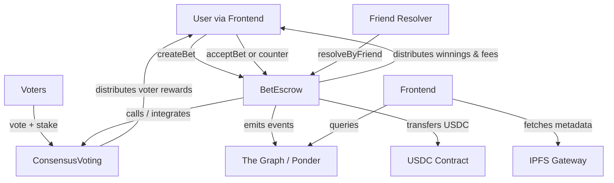

# IBetU System Architecture

**High-Level Overview** (v0.1 focus)

IBetU is a decentralized application (dApp) consisting of on-chain smart contracts for state and funds management + off-chain frontend for user interaction + indexing layer for efficient data access. The core innovation is the hybrid resolution system (friend-appointed + community consensus) with fee-funded incentives.

## Core Components

### 1. Smart Contracts Layer (EVM L2: Base/Arbitrum recommended)

**Primary Contracts** (proposed structure):

- **BetEscrow** (main contract or upgradeable proxy later)
  - Manages bet lifecycle: create, accept/counter, cancel, resolve (friend or via voting module), claim.
  - Holds escrowed USDC stakes (or ERC20 generic).
  - Stores bet metadata: IPFS CID + content hash, settlement criteria hash, odds, stakes, participants, resolver info, status, timestamps.
  - State machine with clear transitions and guards.
  - Events: `BetCreated(uint256 indexed betId, address creator, ...)`, `BetAccepted(...)`, `BetResolved(...)`, `WinningsClaimed(...)`, etc.

- **ConsensusVoting** (or integrated module)
  - Handles open consensus bets: vote casting (with optional stake collateral), tallying (majority or weighted), reward claims from fee pool.
  - Time-window management, eligibility checks.
  - Called by BetEscrow or directly for open bets.
  - Events for votes and claims.

- **FeeTreasury** (or simple internal accounting in BetEscrow)
  - Accumulates platform share of fees.
  - Future: governance-controlled withdrawals or parameter setting.

**Key Interactions**:
- User (via frontend) → `createBet()` / `acceptBet()` / `resolveByFriend()` / `vote()` → state change + events + USDC transfers (via `transferFrom` with approvals).
- Resolver or voters interact directly or through frontend.
- On resolution: BetEscrow distributes winner pot (stakes + minus fees) and sends fee portion to voting rewards or treasury.

**Security Considerations**:
- Reentrancy protection on all value-moving functions.
- Minimal privileged roles (ideally none after deployment; or multisig timelocked for emergencies).
- Custom errors for gas efficiency and clarity.
- Pausable in extreme cases (with multisig or future DAO).
- Thorough testing against economic attacks (e.g. creating many bets to grief resolvers, vote stuffing).

**Data Storage**:
- Critical state & funds: On-chain.
- Rich text (event desc, detailed criteria): IPFS (CID + keccak256 hash stored on-chain for tamper-proofing).

### 2. Frontend / Client Layer

**Tech**: Next.js 14 (TypeScript) + Tailwind CSS + shadcn/ui + wagmi + viem + RainbowKit (or ConnectKit).

**Key User Flows** (to be implemented as pages/components):

1. **Discover / Feed**: List open bets (public proposals). Filters (by resolver mode, stake size, expiry, search by keywords in criteria). Sort options. Click → detail.
2. **Create Bet**: Wizard/form. Textarea for event + criteria (with tips for clarity), odds input (with payout preview), stake amount, resolver mode toggle (Friend: address input; Consensus: auto), deadlines. IPFS upload on submit. Preview before tx.
3. **Bet Detail**: Full criteria display (fetched from IPFS + verified), current status, participants, odds, pot size. Action buttons: Accept (exact), Counter (form for new terms), Vote (if open consensus, with stake input), Claim (if resolved and eligible). Transaction modals with clear explanations.
4. **Dashboard / Portfolio**: Connected wallet's active bets, past resolutions, claimable rewards (USDC), perhaps resolution history/reputation score (future).

**State & Data**:
- Contract reads via wagmi (useContractRead, useWatch, or React Query + indexer).
- IPFS reads via gateway (with hash verification fallback).
- Local state for form drafts, optimistic tx feedback.

**UX Principles**:
- Progressive disclosure: Hide advanced (bond, appeal) behind "Advanced" or info icons initially.
- Risk transparency: Every bet screen shows "Your funds will be locked until resolution. Resolution by [mode]. Fees apply."
- Confirmation dialogs for high-value actions with summary of terms.
- Graceful degradation if IPFS slow or indexer down (show on-chain summary + note).

### 3. Indexing & Query Layer (Optional but Recommended for v1)

- **The Graph** (subgraph) or **Ponder** (TypeScript indexer): Listen to BetEscrow and ConsensusVoting events. Provide fast GraphQL queries for:
  - List of open bets with filters
  - User positions and history
  - Vote tallies and participation
  - Aggregated stats (total volume, popular criteria types)

Alternative for early v0.5: Direct wagmi multicalls + caching. Upgrade to subgraph when query complexity grows.

### 4. External Dependencies & Integrations

- **Wallets**: MetaMask, WalletConnect v2, Phantom (if Solana later), etc. via RainbowKit.
- **USDC**: Circle's USDC on target L2 (or bridged).
- **IPFS**: Pinning service (Pinata recommended for reliability) + public gateways (ipfs.io, cloudflare, etc.).
- **Future Oracles**: Chainlink (prices, sports if available), UMA (optimistic for custom events), RedStone.
- **Monitoring**: Tenderly (tx simulation, alerts), custom Dune or Flipside dashboards post-launch.

## High-Level Data Flow (Mermaid Diagram)



## Contract State Machine (Simplified)

```
Open (proposal live, no taker yet)
  → Accept/Counter → Accepted (stakes locked, awaiting resolution)
  → Resolve (Friend or Consensus vote finalizes outcome)
  → Claim (winner(s) withdraw winnings; fees already distributed or claimable)
  → (Optional) Dispute/Appeal → Re-open to Consensus vote

Cancelled (by creator if no acceptance, or timeout)
```

## Future Architecture Evolutions

- Upgradeable contracts (UUPS proxy) + on-chain governance for params (fee %, timelocks, etc.)
- Multi-chain deployment with unified frontend (or chain-specific sub-apps)
- Dedicated token contract for $IBET (governance, staking for voting power/rewards boost)
- Advanced matching engine (limit orders, partial fills, or simple AMM curve for popular bet types)
- Full DAO transition for treasury and protocol upgrades

## Non-Functional Requirements

- **Security**: Auditable, minimal attack surface, economic soundness primary.
- **Gas Efficiency**: Target < 500k-1M gas for complex txs (vote with many participants) on L2.
- **Availability**: Contracts always live; frontend can be hosted on Vercel/IPFS.
- **Privacy**: Minimal (public bets by design for transparency and discovery). No on-chain PII.
- **Scalability**: L2 first; design for future L3 or Solana if needed.

This architecture prioritizes simplicity and auditability for MVP while providing clear extension points. All major changes must be reflected here and in PROJECT_MEMORY.md.